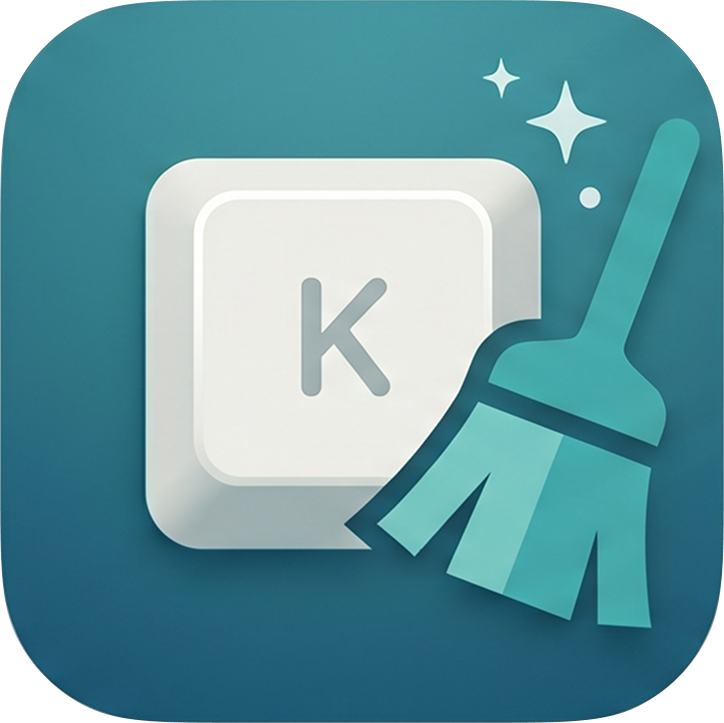

<p align="center">
  
</p>

<h1 align="center">KeepClean</h1>

<p align="center">
  <strong>Temporarily disable your MacBook's keyboard and trackpad so you can clean it without accidental input.</strong>
</p>

<p align="center">
  <a href="https://adhamhaithameid.github.io/keep-clean/">Website</a> · <a href="https://github.com/adhamhaithameid/keep-clean/releases">Download</a> · <a href="docs/install-from-github.md">Install Guide</a> · <a href="docs/faq.md">FAQ</a>
</p>

---

## Why KeepClean?

Every time you wipe down your MacBook, stray keypresses open apps, move windows, and type gibberish. KeepClean solves this in one click — disable the built-in keyboard (and optionally the trackpad), clean your Mac, then re-enable everything instantly.

- **No accounts, no analytics, no internet required.** Runs entirely offline.
- **Lightweight and native.** Built with Swift and SwiftUI.
- **Safe by design.** Keyboard-only mode keeps the trackpad active, and timed mode always auto-recovers.

## Quick Start

1. Download the latest [release](https://github.com/adhamhaithameid/keep-clean/releases) (`.dmg` or `.zip`).
2. Move `KeepClean.app` to your Applications folder.
3. Open it — the one-time setup screen guides you through granting two permissions:
   - **Accessibility** — lets the app intercept keyboard events.
   - **Input Monitoring** — lets the app actually block them.
4. Click **Disable Keyboard** and start cleaning.

> [!TIP]
> If macOS warns about an unsigned app: right-click `KeepClean.app` → **Open** → click **Open** in the dialog.

## Features

### 🧹 Disable Keyboard

Turns off only the built-in keyboard. The trackpad stays fully active, so you can click **Re-enable Keyboard** at any time. This is the safest mode and the recommended starting point.

### 🧼 Disable Keyboard + Trackpad

Turns off both for a configurable timer (15–180 seconds). Everything is restored automatically when the countdown finishes. Perfect for a thorough screen and keyboard wipe.

### ⚙️ Settings

- Choose your preferred timer duration.
- Toggle **auto-start** to begin keyboard-only cleaning the moment you open the app.

### ℹ️ About

Quick links to the GitHub repository and your support options.

## Permissions

KeepClean needs two macOS permissions to work. Both are requested through a guided setup screen that appears the first time you open the app:

| Permission | Why | What happens without it |
|---|---|---|
| **Accessibility** | Create event taps to intercept keyboard events | The app can't disable the keyboard at all |
| **Input Monitoring** | Actually block events from reaching other apps | Events are intercepted but not blocked — keys still type |

If either permission is revoked later, the app automatically returns to the setup screen. You can also re-grant permissions from the banners shown in the main interface.

→ [Full permissions guide](docs/permissions.md)

## Safety

KeepClean is deliberately conservative:

- **Keyboard-only mode** keeps the trackpad active — you always have a way to interact.
- **Timed mode** always has a deadline and auto-recovers.
- **Closing the window quits the app** — it never lingers in the background.
- **Only built-in devices** are affected — external keyboards and mice are never touched.

→ [Safety notes](docs/safety.md)

## Documentation

| Guide | What it covers |
|---|---|
| [Install Guide](docs/install-from-github.md) | Download, install, and first launch |
| [Permissions](docs/permissions.md) | What the app needs and why |
| [Post-Install Checklist](docs/manual-testing.md) | 5-minute walkthrough to verify everything works |
| [Safety Notes](docs/safety.md) | How the app keeps you safe |
| [FAQ](docs/faq.md) | Common questions answered |
| [Troubleshooting](docs/troubleshooting.md) | What to do when something goes wrong |
| [Privacy](docs/privacy.md) | What data the app does (and doesn't) collect |
| [Uninstall](docs/uninstall.md) | How to fully remove KeepClean |

## Build From Source

```bash
git clone https://github.com/adhamhaithameid/keep-clean.git
cd keep-clean
xcodegen generate
xcodebuild -project KeepClean.xcodeproj -scheme KeepClean -configuration Release build
```

**Requirements:** macOS 13.0 (Ventura) or later · Xcode 15+ · [XcodeGen](https://github.com/yonaskolb/XcodeGen)

## Support

If KeepClean saves you from accidental typing, consider buying me a coffee:

<a href="https://buymeacoffee.com/adhamhaithameid">
  
</a>

## License

Source-available under the [PolyForm Noncommercial 1.0.0](LICENSE.md) license.
